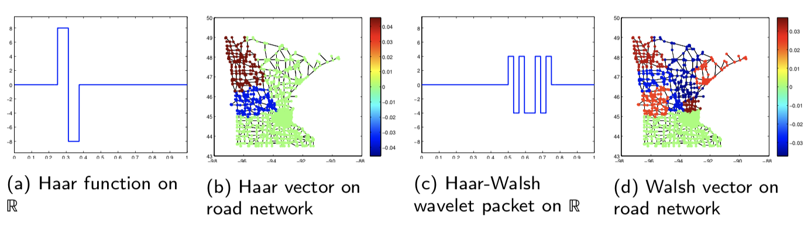

# MultiscaleGraphSignalTransforms.jl
Documentation: [](https://haotian127.github.io/MultiscaleGraphSignalTransforms.jl/dev)



## COPYRIGHT

Copyright 2015-2021 The Regents of the University of California

Implemented by Jeff Irion, Haotian Li, Naoki Saito, and Yiqun Shao


## SETUP

To install the MultiscaleGraphSignalTransforms.jl, run
```julia
julia> import Pkg; Pkg.add("MultiscaleGraphSignalTransforms")
julia> using MultiscaleGraphSignalTransforms
```

## GETTING STARTED

Currently, you can run a set of very small tests via ```] test MultiscaleGraphSignalTransforms```; see the actual file ```test/runtest.jl``` for more details.

## REFERENCES

1. J. Irion and N. Saito, [Hierarchical graph Laplacian eigen transforms](http://doi.org/10.14495/jsiaml.6.21), *Japan SIAM Letters*, vol. 6, pp. 21-24, 2014.

2. J. Irion and N. Saito, [The generalized Haar-Walsh transform](http://dx.doi.org/10.1109/SSP.2014.6884678), *Proc. 2014 IEEE Statistical Signal Processing Workshop*, pp. 488-491, 2014.

3. J. Irion and N. Saito, [Applied and computational harmonic analysis on
graphs and networks](http://dx.doi.org/10.1117/12.2186921), *Wavelets and Sparsity XVI*, (M. Papadakis, V. K. Goyal, D. Van De Ville, eds.), *Proc. SPIE 9597*, Paper #95971F, Invited paper, 2015.

4. J. Irion, [Multiscale Transforms for Signals on Graphs: Methods and Applications](https://jefflirion.github.io/publications_and_presentations/irion_dissertation.pdf), Ph.D. dissertation, University of California, Davis, Dec. 2015.

5. J. Irion and N. Saito, [Learning sparsity and structure of matrices with multiscale graph basis dictionaries](http://dx.doi.org/10.1109/MLSP.2016.7738892), *Proc. 2016 IEEE 26th International Workshop on Machine Learning for Signal Processing (MLSP)*, (A. Uncini, K. Diamantaras, F. A. N. Palmieri, and J. Larsen, eds.), 2016.

6. J. Irion and N. Saito, [Efficient approximation and denoising of graph signals using the multiscale basis dictionaries](http://dx.doi.org/10.1109/TSIPN.2016.2632039), *IEEE Transactions on Signal and Information Processing over Networks*, Vol. 3, no. 3, pp. 607-616, 2017.

7. Y. Shao and N. Saito, [The extended Generalized Haar-Walsh Transform and applications](https://www.math.ucdavis.edu/~saito/publications/saito_eghwt.pdf), *Wavelets and Sparsity XVIII*, (D. Van De Ville, M. Papadakis, and Y. M. Lu, eds.), *Proc. SPIE 11138*, Paper #111380C, 2019.

8. Y. Shao, The Extended Generalized Haar-Walsh Transform and Applications, Ph.D. dissertation, University of California, Davis, Sep. 2020.

9. H. Li and N. Saito, [Metrics of graph Laplacian eigenvectors](https://www.math.ucdavis.edu/~saito/publications/metgraphlap.html), *Wavelets and Sparsity XVIII*, (D. Van De Ville, M. Papadakis, and Y. M. Lu, eds.), *Proc. SPIE 11138*, Paper #111381K, 2019.

10. C. Alexander, H. Li and N. Saito, [Natural graph wavelet packet dictionaries](https://link.springer.com/article/10.1007/s00041-021-09832-3), *J. Fourier Anal. Appl.*, vol. 27, Article \#41, 2021.

11. H. Li, Natural Graph Wavelet Dictionaries: Methods and Applications, Ph.D. dissertation, University of California, Davis, Jun. 2021.
